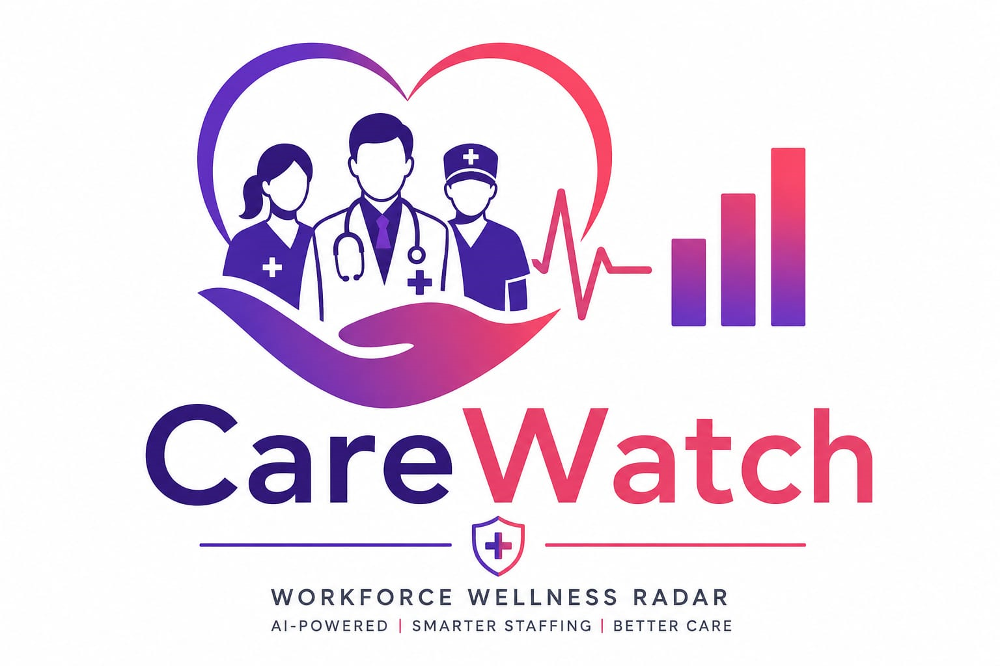
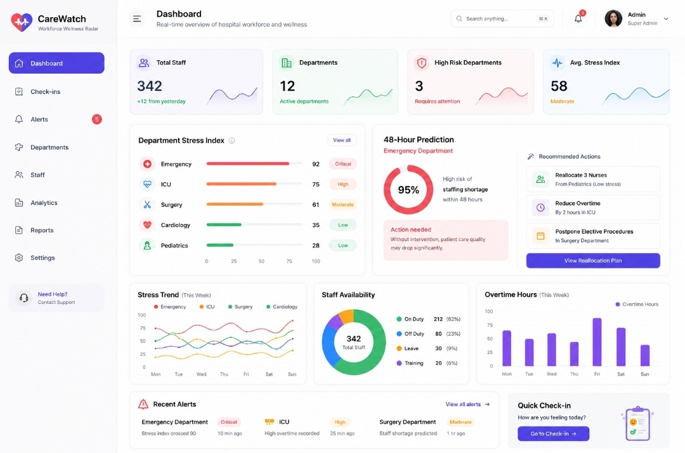
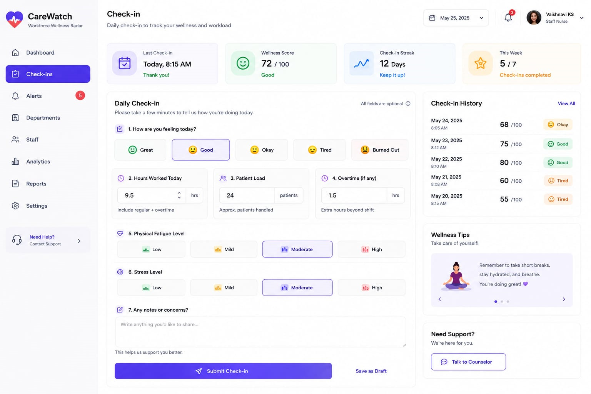
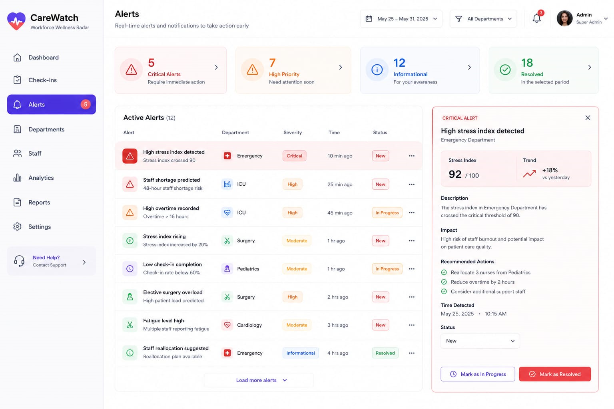
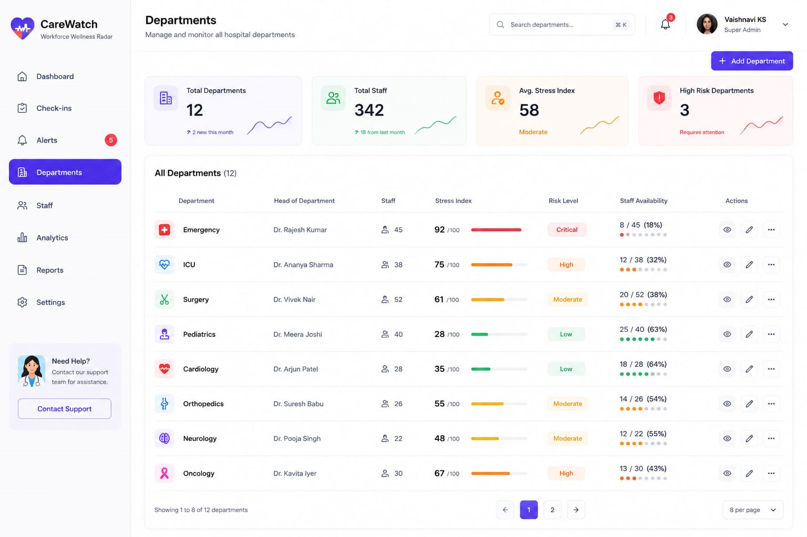
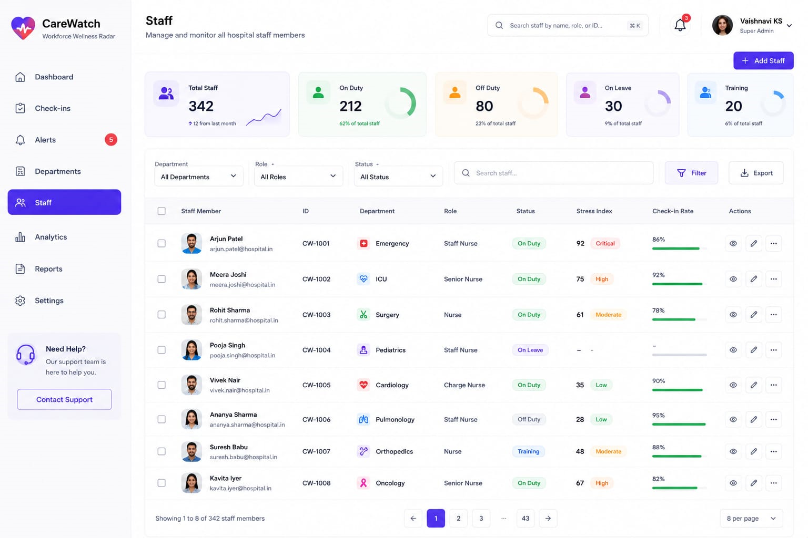
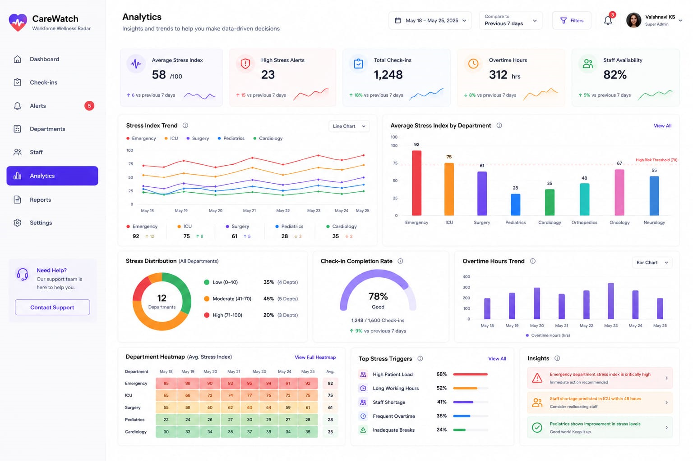
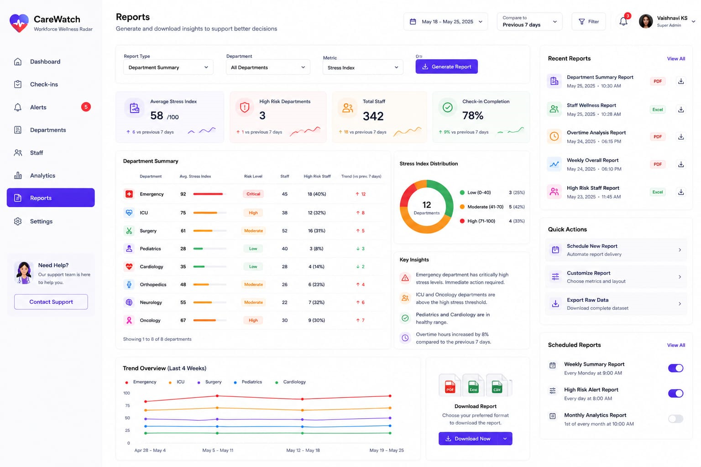

<p align="center">
  
</p>

<h1 align="center">🏥 CareWatch</h1>

<p align="center">
AI-Powered Workforce Wellness & Staffing Radar
</p>

<p align="center">


</p>

---

# 📸 Project Preview

<p align="center">
  
</p>

---

# 📌 Project Overview

CareWatch is an AI-powered workforce wellness and staffing radar developed to help hospitals proactively monitor staff well-being, identify burnout risks, and optimize workforce allocation. The platform analyzes operational data such as workload, overtime, attendance, and wellness check-ins to generate a real-time Department Stress Index and predict staffing shortages up to 48 hours in advance. With actionable insights and intelligent recommendations, CareWatch enables hospital administrators to make informed decisions that improve staff wellness and ensure uninterrupted patient care.

---

# 🚨 Problem Statement

Healthcare institutions often face staff shortages, burnout, and uneven workload distribution, affecting both employee well-being and patient outcomes. Existing systems mainly react to workforce issues after they occur, rather than predicting them. There is a need for a centralized, AI-driven solution that continuously monitors workforce health and provides early warnings to support proactive staffing decisions.

---

# 💡 Solution

CareWatch leverages AI and predictive analytics to transform workforce data into meaningful insights. It continuously evaluates employee workload, attendance, overtime, patient load, and wellness check-ins to calculate a live Department Stress Index. The platform predicts staffing shortages, highlights high-risk departments through alerts, and recommends staff reallocation strategies, enabling hospitals to prevent burnout before it impacts patient care.

---

# ✨ Features

- 📊 Real-time Dashboard
- ❤️ Daily Wellness Check-ins
- 🚨 Smart Alert System
- 🤖 AI-based 48-Hour Staffing Prediction
- 📈 Analytics Dashboard
- 👥 Staff Management
- 🏥 Department Management
- 📑 Automated Reports
- ⚙️ System Settings
- 📱 Responsive UI

---

# 🛠️ Tech Stack

### Frontend
- React.js
- Vite
- Tailwind CSS
- JavaScript

### Backend
- Node.js
- Express.js

### Database
- PostgreSQL / Firebase

### AI & Machine Learning
- Python
- Flask
- Scikit-learn

### Design
- Figma

---

# 🚀 Installation

```bash
git clone https://github.com/yourusername/CareWatch.git

cd CareWatch

npm install

npm run dev
```

---

# 📂 Folder Structure

```text
carewatch/
├── assets/
├── public/
├── src/
│   ├── components/
│   ├── pages/
│   ├── layouts/
│   ├── services/
│   └── App.jsx
├── package.json
└── README.md
```

---

# 📸 Screenshots

| Dashboard |
|------------|
|  |

| Check-ins | Alerts |
|------------|--------|
|  |  |

| Departments | Staff |
|-------------|-------|
|  |  |

| Analytics | Reports |
|------------|---------|
|  |  |

| Settings |
|----------|
|  |

---

# 🔮 Future Scope

- Mobile application for Android & iOS
- Wearable health device integration
- AI chatbot for employee wellness
- Integration with Hospital Management Systems
- Predictive leave planning
- Multi-hospital monitoring
- Cloud deployment
- Advanced AI models for workforce optimization

---

# 👨‍💻 Tech Titans

**Project:** CareWatch – AI-Powered Workforce Wellness & Staffing Radar

**Team Name:** Tech Titans

**Team Members**
- Vaishnavi KS (Team Lead)
- Varshitha BN

---

# 📄 License

This project is developed for academic and hackathon purposes.

---

## ⭐ If you like this project, give it a star on GitHub!
